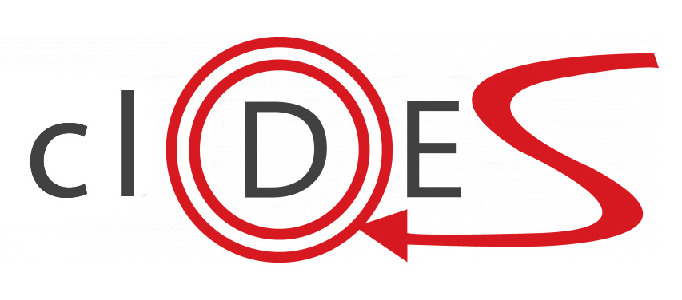

# clDES

Efficient algorithms for **Discrete-Event Systems**/deterministic
finite state automatons
operations targeting heterogeneous platforms.
A **Supervisor Synthesizer** algorithm is also available.



## Implementation

**clDES** uses a graph based model to represent discrete-event systems,
which are implemented with adjacency sparse matrices. It has a
[ViennaCL](http://viennacl.sourceforge.net/) OpenCL back-end to enable
a *gpgpu* approach. The CPU processing is made using the
[Eigen3](http://eigen.tuxfamily.org) library and it can exploit multiple
cores present in your hardware by enabling OpenMP on your compiler.

> Only CPU operations are available now. The *OpenCL* code is being refactored.
> ViennaCL is going to be replaced by VexCL + custom kernels implementation.

### Available operations

Automaton operation | Implementation
-------------------|----------------
Accessible part | `cldes::DESystem<NEvents, StorageIndex>::accessiblePart()`
Coaccessible part | `cldes::DESystem<NEvents, StorageIndex>::coaccessiblePart()`
Trim | `cldes::DESystemBase<NEvents, StorageIndex>::trim()`
Synchronization: parallel composition | `cldes::op::synchronize<NEvents, StorageIndex>()`
Observer Property Checker | `cldes::DESystem<NEvents, StorageIndex>::containsObsProp()`
Controller Synthesis | `cldes::op::supC<NEvents, StorageIndex>()`
Projection | `cldes::op::proj<NEvents, StorageIndex>()`

## Compiling

Follow the instructions bellow to build the project.

### Requirements

It is necessary to make sure that **CMake 3.11** is installed, such as
**LLVM Clang 6** ~~or **GCC/G++ 8**~~ developer tools.

System support to **Boost** Library version `>= 1.58`
and **Eigen3** Library are required. **OpenCL** version `>= 1.2`, and
**OpenMP** version `>= 5` are optional.

> It may compile and run smoothly on older versions. These tools mentioned above
> compose the tool chain used to develop and to test so far, **ArchLinux** and
**Fedora 28**. **GCC build currently broken. Use CLang instead.**

**clDES** embedded libraries so far:

* [ViennaCL 1.7.1](http://viennacl.sourceforge.net/): Efficient linear algebra
  library for computations on many-core architectures.
* [Sparsepp](https://github.com/greg7mdp/sparsepp): The faster sparse hash
  sets/maps **C++14** implementation I know.

> ~~It is always necessary to set `CLDES_INCLUDE_PATH` to run **clDES** applications
> which execute operations that use custom *OpenCL* kernels, such as
> `cldes::op::Syncronization()`~~. **Custom Kernels Currently disabled.**

### Build project

**clDES** is a template library, which means you only need to copy it to
a directory on your compiler search path. However, you may want to compile
it to run its benchmarks and tests.
After checking if all requirements are satisfied, compile the project:

```bash
$ export CC=/usr/bin/clang
$ export CXX=/usr/bin/clang++
$ export CLDES_INCLUDE_PATH=<clDES_root>/include/
$ cd  <clDES_root>
$ mkdir build; cd build
$ cmake ..
$ make -j4
```

#### Optional features

To enable *OpenMP* or *OpenCL*, it is necessary to set the corresponding flags:

*OpenMP*:
```bash
# [...]
$ cmake -DCLDES_OPENMP_ENABLED=true ..
$ make -j4
```

*OpenCL*:
```base
# [...]
$ cmake _DCLDES_OPENCL_ENABLED=true ..
$ make -j4
```

### Dev build

If you wanna contribute to **clDES**, you may want a debug build by setting
**CMake**'s flag `BUILD_TYPE` to `Debug`:

```bash
$ export CC=/usr/bin/clang
$ export CXX=/usr/bin/clang++
$ export CLDES_INCLUDE_PATH=<clDES_root>/include/
$ cd  <clDES_root>
$ mkdir build; cd build
$ cmake -DCMAKE_BUILD_TYPE=Debug ..
$ make -j4
```

## Running tests

After inserting code, or if you just want to test the library, execute the tests
using **CTest**:

```
$ cd <clDES_root>/build
$ make test
```
